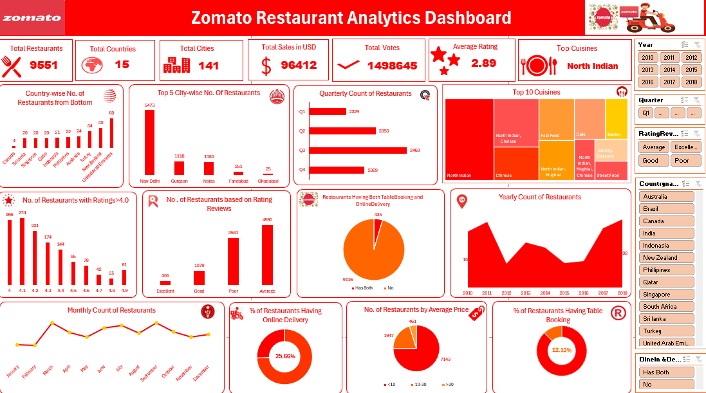

# 🍽️ Zomato Data Analysis Project

## 📌 Overview

This project analyzes Zomato restaurant data to uncover insights about ratings, cuisines, pricing, and customer preferences across different cities.

---

## 🎯 Objectives

* Analyze restaurant distribution across countries and cities
* Identify top cuisines and popular locations
* Study ratings and customer behavior
* Understand pricing and delivery trends

---

## 🛠️ Tools Used

* 📊 Microsoft Excel
* 📈 Tableau
* 📉 Power BI
* 🗄️ MySQL

---

## 📂 Files Included

* `zomato-dashboard-excel.xlsx` → Excel dashboard
* `zomato-sql-queries.sql` → SQL analysis
* `zomato-tableau.twbx` → Tableau dashboard
* `zomato-powerbi.pbix` → Power BI dashboard

---

## 📷 Dashboard Preview

---

## 🔍 Key Insights

* North Indian cuisine is the most popular
* Majority of restaurants fall in average rating category
* Online delivery is available for a smaller percentage of restaurants
* Certain cities dominate restaurant count

---

## 🚀 Outcome

This project helped me improve:

* Data analysis skills
* Data visualization techniques
* Business insight generation

---

## 📷 u=Excel Dashboard Preview

## 👨‍💻 Author

**Basavaraj Jadhav**
